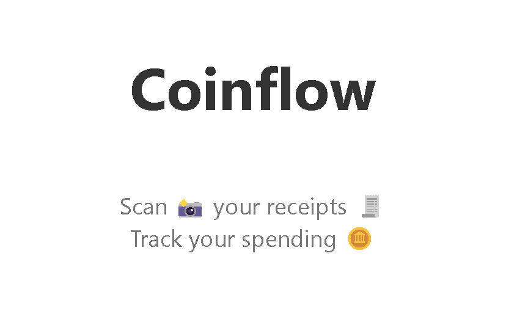

<p align="center">
  

---
## Table of Contents
- [Overview](#overview)
- [Features](#features)
- [Technologies](#technologies)
- [Installation](#installation)
- [Usage](#usage)
- [Roadmap](#roadmap)
- [License](#license)

---
## Overview

Coinflow is a mobile-first web application that enables users to scan their receipts and keep track of their expenses on a monthly basis. The application is able to extract important details from scanned receipts via Azure Form Recognizer and allow users to manage their expense data. As more receipts are scanned, users can view their monthly expenses and compare their spending habits over time. Users can also set monthly budgets and receive email notifications when they are close to exceeding their budget.

By making the process of tracking expenses more convenient, Coinflow aims to help users better manage their finances and make more informed financial decisions.

The application is built with a ReactJS frontend, NodeJS backend, and deployed to Azure App Services. The user data is secured with JWT authentication and stored in Azure Cosmos DB. See the [Technologies](#technologies) section for more details.

---
## Features

The application is currently in development. The following features are available:

- **Passwordless authentication via email**: Passwords discourage users to get started with an app. In Coinflow, a new or existing user supplies their email address to receive a one-time verification code.

- **Receipt scanning**: Users can upload a receipt image to the application via their camera. The application will extract important details from the receipt image and store the data in the database.

- **Expense management**: Users can view their expense data and manage their expenses.

- **Budget management**: Users can set monthly budgets and receive email notifications when they are close to exceeding their budget.

---
## Technologies Used
This project makes use of several technologies to provide a comprehensive solution. The key technologies used in this project include:

**Frontend**
- **ReactJS:** The frontend of the application is implemented as a React application.

- **Nginx:** The frontend is served by an Nginx web server in production. This allows the frontend to be served in a more performant and scalable manner.

**Backend**
- **Node.js:** The Node.js backend is responsible for handling API requests, processing data, and interfacing with Azure cloud resources such as Azure Cosmos DB, Azure Form Recognizer, Azure Cache for Redis, and Azure Communication Services.

**Cloud**
- **Azure Form Recognizer:** Form Recognizer is used to extract important details from scanned receipts through uploaded images. The application stores the merchant name, total amount, and date.

- **Azure Communication Services:** Communication Services is used to send SMS/email messages to users for passwordless authentication and as well as notifications. The application currently only supports email, but SMS support will be added in the future.

**Database**
- **Azure Cache for Redis:** A Redis cache is used to store the temporary verification codes for passwordless authentication. This was chosen over a database solution due to the speed and simplicity of Redis, and the fact that the data would be temporary.

- **Cosmos DB:** A NoSQL database is used to store all user data. This includes user information, expense data, and budget data. Cosmos DB was chosen over a relational database due to the flexibility of NoSQL databases and its ability to scale horizontally.

**Deployment**
- **Docker:** Docker is used to containerize the frontend and backend applications. This allows the application to be deployed in a more consistent and scalable manner.

- **Azure App Service:** The frontend and backend containers are deployed to Azure App Services for public hosting. This allows the application to be deployed in a more scalable manner.

---
## Installation

To run the application locally, you will need to have the following installed:

- [Node.js](https://nodejs.org/en/)
- [Azure CLI](https://docs.microsoft.com/en-us/cli/azure/install-azure-cli)

1. Clone the repository:
```sh
git clone <repo-url>
```

2. Navigate to the project directory:
```sh
cd Coinflow
```

3. The application requires a `.env` file to be present in the the `/frontend` and `/backend` directories of the project. See the `.env.template` files in those directories for an example of the required environment variables.
    - The `AUTH_API_SECRET` variable is used to sign and verify JSON Web Tokens (JWTs) used for authentication. It should be set to a random string of characters.
    - The remaining fields are used to connect to the Azure cloud resources. Supply the required values for each field.
    - The backend cloud configuration can be tested via running `npm test` in the `/backend` directory, which will run the test suite.

4. The Vue frontend also requires a `.env` file to be present in the `/frontend` directory. See the `/frontend/.env.template` file for an example of the required environment variables.
    - The `REACT_APP_API_URL` variable points to the backend API URL. It should be set to `http://localhost` for local development, and the production URL for production deployment.

5. Run `npm i` to install node packages in the `/frontend` and `/backend` directories, and `npm start` to start the frontend and backend servers, respectively. By default, the react app will be served at `http://localhost:3000` and the backend API will be served at `http://localhost:80`.

---
## Usage

Navigate to the frontend URL and you should see the Login page. Enter your email address and click the "Send Code" button. You should receive an email with a verification code. Enter the code in the "Verification Code" field and click the "Verify" button. You should be redirected to the Home page.

The Home page consists of a display at the top indicating the total expense amount for the month, a section for adding and editing a budget, a button for scanning new receipts, and a table for viewing and managing previous expenses.

---
## License
Distributed under the MIT License. See [`LICENSE.md`](./LICENSE) for more information.